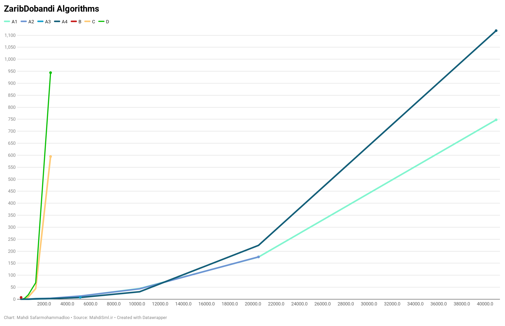

# TarahiAlgorithmTamrin1

روش A1 : محاسبه با روش مستقیم (محاسبه فاکتوریل با حلقه)

روش A2 : محاسبه با روش مستقیم (محاسبه فاکتوریل با بازگشتی)

روش A3 : محاسبه با روش مستقیم (محاسبه فاکتوریل با بازگشتی و تابع یادآور)

روش A4 : محاسبه با روش مستقیم (محاسبه فاکتوریل با برنامه نویسی پویا)

روش B : محاسبه با روش بازگشتی

روش C :محاسبه با روش بازگشتی و تابع یادآور

روش D : محاسبه با روش برنامه نویسی پویا

سیستم تست شده :
Corei5-6200U
8G Ram

زبان برنامه نویسی استفاده شده : Kotlin
بر روی JVM (java virtual machine) 1.7

هر تست 100 بار تکرار شده و میانگین آن به نمایش درآمده
تست به این گونه انجام شده است که مقدار N در فرمول ، NK است
و مقدار K در فرمول ، NK/2 است
یعنی همیشه K نصف N میباشد تا کشیدن نمودار و مقایسه راحت تر شود

*روش B (بازگشتی) در n = 40 و k = 20 رام نشدنی میشود

*روش C (بازگشتی و تابع یادآور) و روش D (برنامه نویسی پویا) 
 در n = 5120 و k = 2560 رام نشدنی میشوند

*روش A3 (روش مستقیم (محاسبه فاکتوریل با بازگشتی و تابع یادآور))
 در n = 10240 و k = 5120 با خطای Stack Overflow روبرو شد

*روش A2 (روش مستقیم (محاسبه فاکتوریل با بازگشتی))
 در n = 10240 و k = 5120 با خطای Stack Overflow روبرو شد

